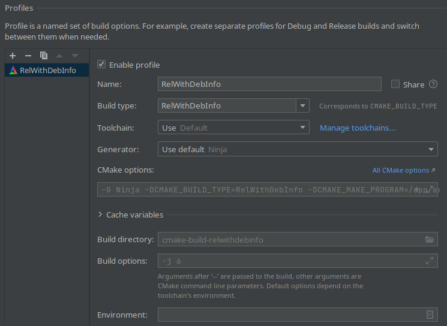

# Molecular Dynamics Code for IMTEK-HPC-MD class

This repository contains a [CMake](https://cmake.org/) skeleton for the [HPC MD
with C++
project](https://imtek-simulation.github.io/MolecularDynamics/_project/general_remarks.html).

## Getting started

Click the `Use this template` button above, then clone the newly created
repository, as described in [the first
milestone](https://imtek-simulation.github.io/MolecularDynamics/_project/milestone01.html).

### Compiling using CLion

> Note: for Windows users, please follow [these
> instructions](https://www.jetbrains.com/help/clion/how-to-use-wsl-development-environment-in-product.html)
> in addition to the text below.

If you are using CLion, you can open your freshly cloned project by clicking on
the "Open" button in the CLion welcome window. If prompted, trust the project.
Then follow the wizard until you see a window that defined the "Profiles", which
should look something like this:



If you've missed the wizard, you can go back to this dialog in "**File >
Settings > Build, Execution, Deployment > CMake**". This windows allows to set the
`CMAKE_BUILD_TYPE` variable, which controls the level of optimization applied to
the code. `Debug` disables optimizations and turns on useful debugging features.
This mode should be used when developing and testing code.
`Release` turns on aggressive optimization. This mode should be used when
running production simulations.

Add a `Debug` profile and a `Release` profile. When compiling, you can switch
between them in the dialog right of the green hammer.

To run the first milestone executable, click on the dialog directly right of the
green hammer in the upper right toolbar, select "01", and click
the green arrow right of that dialog. You should see the output in the "Run"
tab, in the lower main window.

To run the tests, select "All CTest" in the same dialog, then run. In the lower
window, on the right, appears a panel that enumerates all the tests that were
run and their results.

Try compiling and running for both `Debug` and `Release` configurations. Don't
forget to switch between them when testing code or running production simulations.

### Compiling in the command line

The command line (terminal) may look daunting at first, but it has the advantage
of being the same across all UNIX platforms, and does not depend on a specific
IDE. The standard CMake workflow is to create a `build/` directory which will
contain all the build files. To do that, and compile your project, run:

```bash
cd <your repository>

# Create build directory
mkdir build
cd build

# Configure & compile
cmake -DCMAKE_BUILD_TYPE=Debug ..
make

# Run executable and tests
./milestones/01/01
make test
```

If there are no errors then you are all set! Note that the flag
`-DCMAKE_BUILD_TYPE=Debug` should be changed to
`-DCMAKE_BUILD_TYPE=Release` when you run a production simulation, i.e. a
simulation with more than a few hundred atoms. This turns on aggressive compiler
optimizations, which results in speedup. However, when writing the code and
looking for bugs, `Debug` should be used instead.

Try compiling and running tests with both compilation configurations.

### Compiling on bwUni, with MPI

The above steps should be done *after* loading the appropriate packages:

```bash
module load compiler/gnu devel/cmake mpi/openmpi

# then in build/
cmake -DCMAKE_BUILD_TYPE=Release -DUSE_MPI=ON ..
make
```

## How to add code to the repository

There are three places where you are asked to add code:

- `src/` is the core of the MD code. Code common to all the simulations you will
  run should be added here. This includes implementation of time stepping
  scheme, potentials, thermostats, neighbor lists, atom containers, and
  implementation files that will be provided by us (e.g. domain decomposition
  implementation). The `CMakeLists.txt` file in `src/` creates a [static
  library](https://en.wikipedia.org/wiki/Static_library) which is linked to all
  the other targets in the repository, and which propagates its dependency, so
  that there is no need to explicitely link against Eigen or MPI.
- `tests/` contains tests for the library code code. It uses
  [GoogleTest](https://google.github.io/googletest/) to define short, simple
  test cases. This is where you will add tests for the time integration,
  potentials, thermostats, etc., but it should not contain "real physics"
  simulations, such as heat capacity calculations.
- `milestones/` contains the "real physics" simulations that are required in
  milestones 04, 07, 08, 09.

### Adding to `src/`

Adding files to `src/` is straightforward: create your files, e.g. `lj.h` and
`lj.cpp`, then the `MY_MD_HEADERS` and `MY_MD_CPP` variables in
`CMakeLists.txt`:

```cmake
# List of headers
set(MY_MD_HEADERS
    verlet.h
    lj.h
)

# List of implementation files
set(MY_MD_CPP
    verlet.cpp
    lj.cpp
)
```

### Adding to `tests/`

Create your test file, e.g. `test_verlet.cpp` in `tests/`, then modify the
`MY_TESTS_CPP` variable in `tests/CMakeLists.txt`. You should not need to create
headers, but if you do, also modify `MY_TESTS_HEADERS`. Test that your test was
correctly added by running `make test` in the build directory: your test should
show up in the output.

### Adding to `milestones/`

Create a new directory, e.g. with `mkdir milestones/04`, uncomment the relevant
line in `milestones/CMakeLists.txt`, then create & edit
`milestones/04/CMakeLists.txt`:

```cmake
add_executable(04 main.cpp)
target_link_library(04 my_md_lib)
```

You can now create & edit `milestones/04/main.cpp`, which should include a
`main()` function as follows:

```c++
int main(int argc, char* argv[]) {
    return 0;
}
```

The code of your simulation goes into the `main()` function.

## Pushing code to GitHub

If you have added files to your local repositories, you should commit and push them to
GitHub. To create a new commit (i.e. put your files in the repository's
history), simply run:

```bash
git status
# Look at the files that need to be added
git add <files> ...
git commit -m '<a meaningful commit message!>'
git push
```

This repository is setup with continuous integration (CI), so all your tests
will run automatically when you push. This is very handy to test if you have
breaking changes.

### Git in CLion

If you are using CLion, you can use Git directly from its interface. To add
files, right click the file you wish to add, then "Git > Add". Once you are
ready to commit, "Git > Commit" from the main menu bar. Add a message in the
lower left window where it reads "Commit message", then click "Commit" or
"Commit and Push...".
